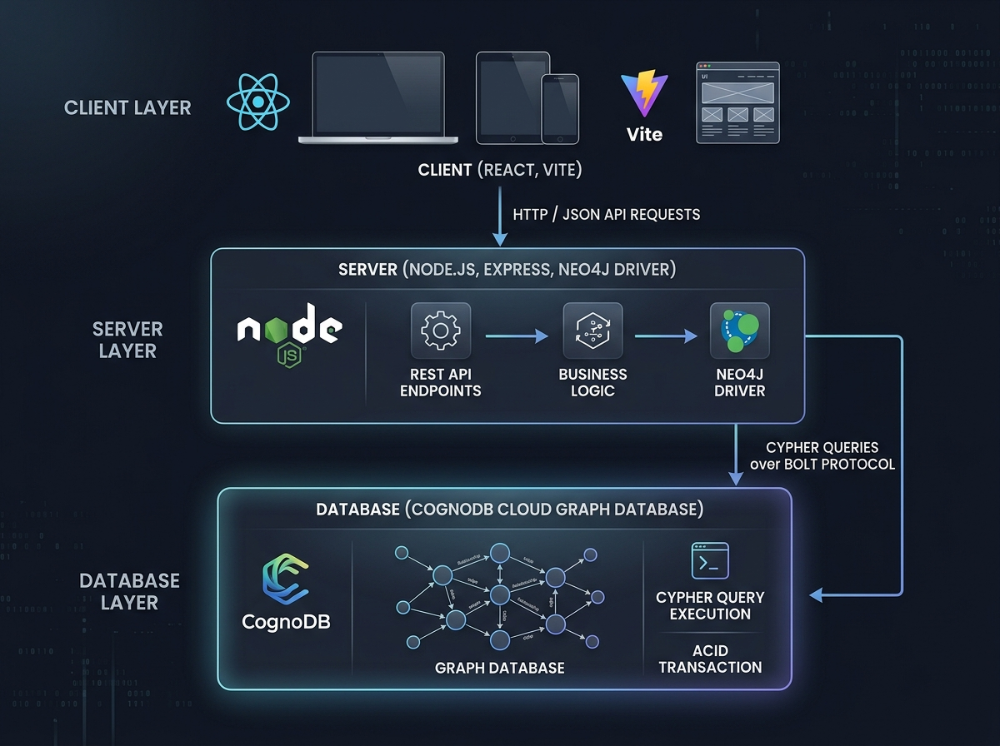
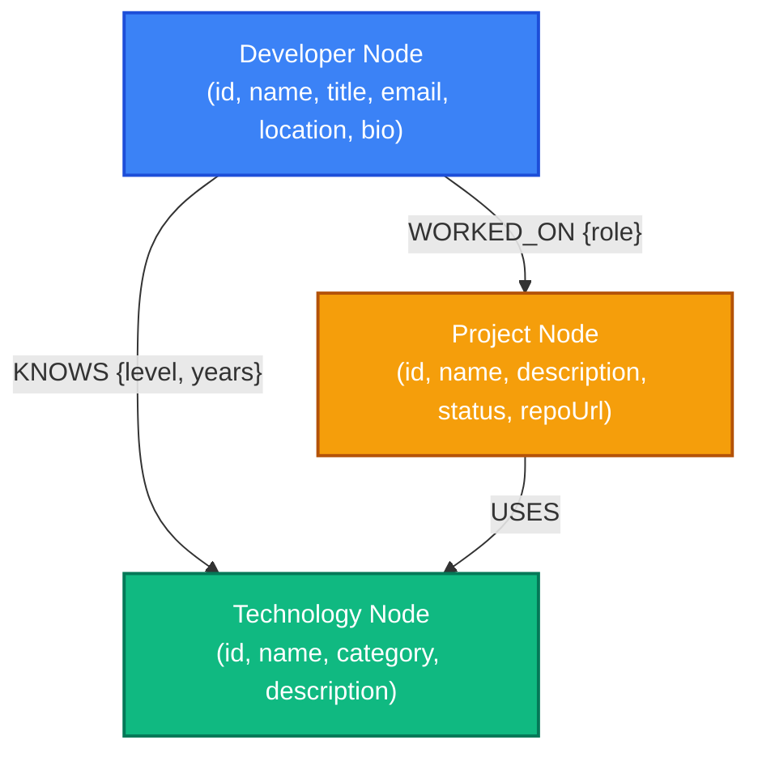
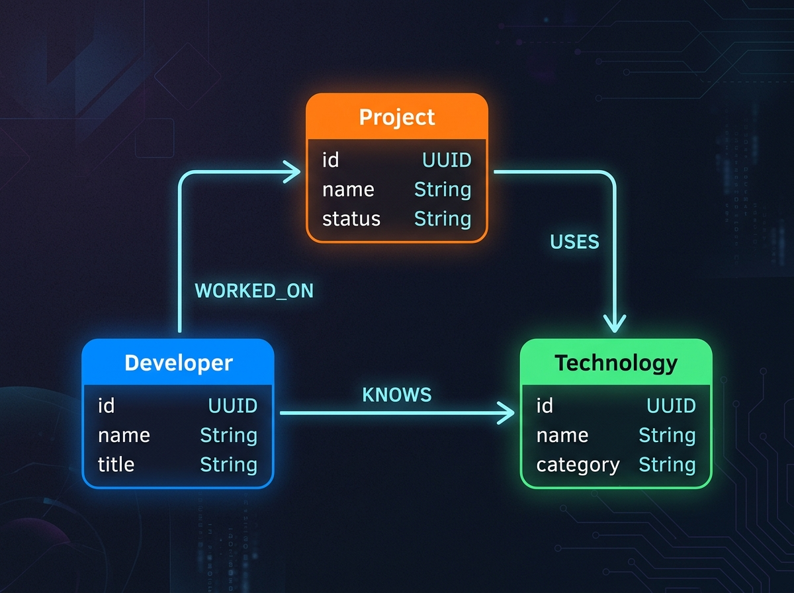
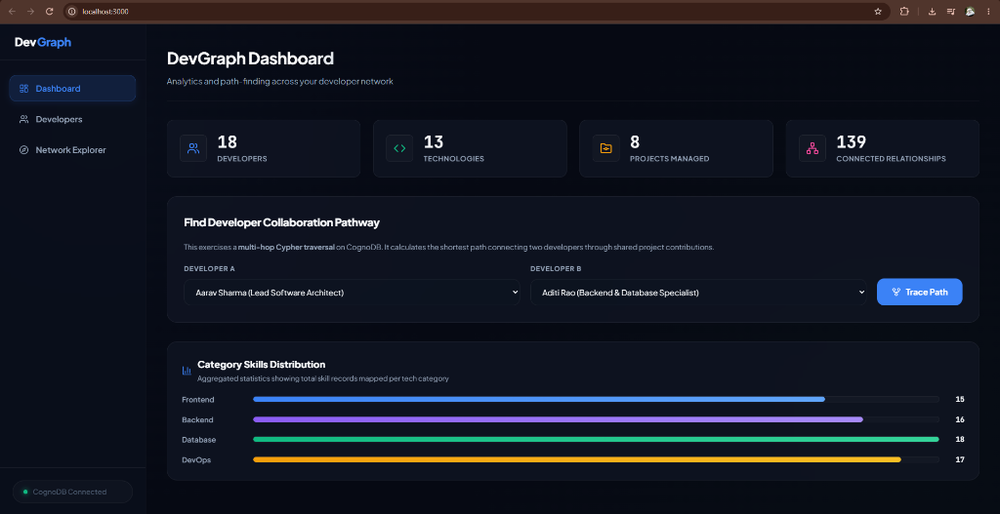
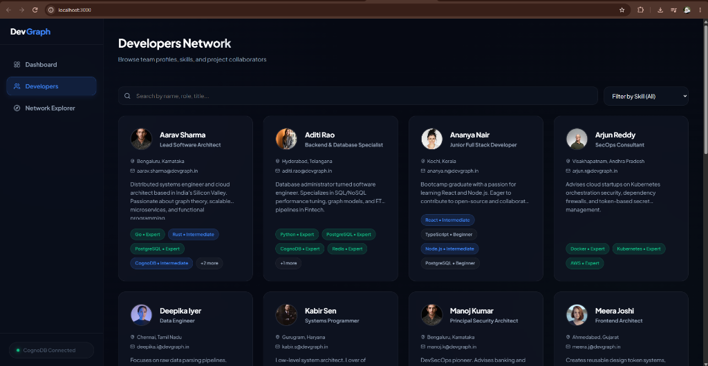
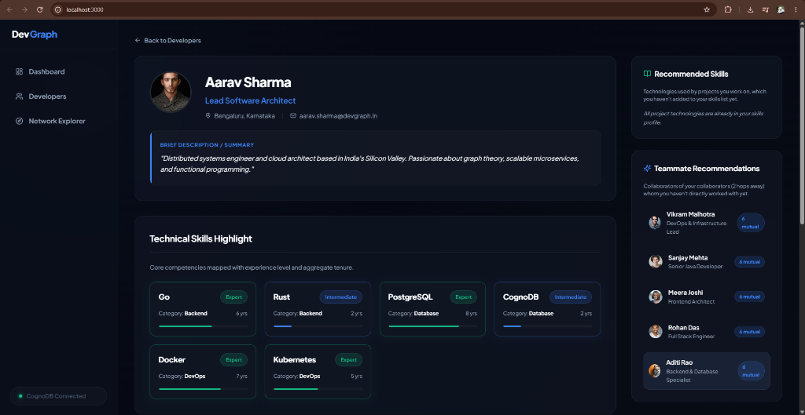
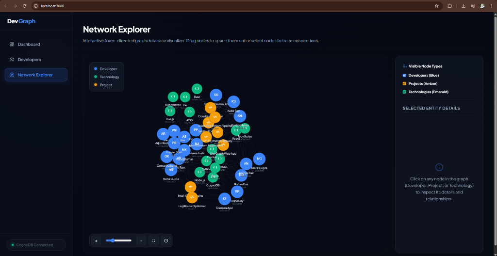

# DevGraph: Developer Connection & Skills Network Explorer

### 🔗 Project Deliverables
* **Hosted Live Demo**: [https://dev-graph-silk.vercel.app/](https://dev-graph-silk.vercel.app/)
* **Screen Recording Walkthrough**: [Watch Walkthrough Video](https://drive.google.com/file/d/1zuIKsHKGNJ2_RhJVTI4ETk95tZ3W6Vgi/view?usp=drive_link)

DevGraph is a full-stack web application that maps, explores, and visualizes developer teams, their skill sets, and their shared project histories. Built on top of **CognoDB Cloud**, a managed graph database speaking openCypher, DevGraph allows organizations to query complex social networks, compute degrees of separation between developers, and make graph-powered project/skill recommendations.



## Why a Graph Database?

In a relational database (RDBMS), modeling developers, skills, and projects requires multiple junction tables (`DeveloperSkills`, `DeveloperProjects`, `ProjectTechnologies`) full of foreign keys. 

As the network grows, answering simple business questions becomes highly inefficient:
* **Collaboration Paths (Multi-hop)**: Tracing how Developer A is connected to Developer B through collaborators requires recursively joining `DeveloperProjects` onto itself. A 3-hop traversal translates to 6 table joins, which degrades performance quadratically.
* **Recommendations**: Finding "technologies a developer is exposed to but doesn't know yet" requires scanning cross-junction tables. 
* **Dynamic Schema**: Skills and roles evolve. Graph databases store relationships as physical pointers between nodes, meaning we can traverse paths in logarithmic time ($O(\log N)$ or $O(d)$ where $d$ is path length) regardless of total database size.

CognoDB stores developers, technologies, and projects as **Nodes** (vertices), and skills or contributions as **Relationships** (edges). This allows us to run path-finding algorithms and recommendation queries with simple, readable Cypher queries that execute in milliseconds.

---

## 1. Graph Data Model

The database represents three core entities (nodes) and three connections (relationships):

### Nodes
* **`Developer`**: `{ id, name, title, email, location, bio, avatarUrl }`
* **`Technology`**: `{ id, name, category, description }`
* **`Project`**: `{ id, name, description, status, repoUrl }`

### Relationships
* **`(Developer)-[:KNOWS { level, years }]->(Technology)`**: Tracks a developer's technology stack and years of experience.
* **`(Developer)-[:WORKED_ON { role }]->(Project)`**: Tracks project team members and their specific roles.
* **`(Project)-[:USES]->(Technology)`**: Tracks the technology stack used by a project.

#### Visual Data Schema




---

## 2. Explanation of Key Cypher Queries

### A. Developer Collaboration Pathway (Multi-Hop Shortest Path)
Finds the shortest collaboration chain between any two developers through shared project work.
```cypher
MATCH path = shortestPath((d1:Developer {id: $devId1})-[:WORKED_ON*..10]-(d2:Developer {id: $devId2}))
RETURN path
```
* **How it works**: By searching only along `WORKED_ON` relationships, CognoDB traverses project team rosters to trace the degrees of separation between two developers, returning the entire subgraph (nodes and edges) for visual plotting.

### B. Up-skilling / Technology Recommendations
Finds technologies used in projects a developer worked on, but which they do not yet list as a skill.
```cypher
MATCH (d:Developer {id: $id})-[:WORKED_ON]->(p:Project)-[:USES]->(t:Technology)
WHERE NOT (d)-[:KNOWS]->(t)
RETURN t { .*, exposureCount: count(p) }
ORDER BY t.exposureCount DESC
```
* **How it works**: It traces the developer's projects to their technology stacks, filters out the technologies the developer already `KNOWS`, and tallies how many times they've been exposed to the remaining technologies, suggesting what they should learn next.

### C. Teammate Collaborator Recommendations (2-Hop Separations)
Finds developers who have worked with the active developer's direct collaborators, but who have never worked on a project with the active developer directly.
```cypher
MATCH (d:Developer {id: $id})-[:WORKED_ON]->(:Project)<-[:WORKED_ON]-(colleague:Developer)
MATCH (colleague)-[:WORKED_ON]->(p:Project)<-[:WORKED_ON]-(recommendation:Developer)
WHERE recommendation <> d 
  AND NOT (d)-[:WORKED_ON]->(:Project)<-[:WORKED_ON]-(recommendation)
RETURN recommendation { .*, mutualCount: count(distinct colleague) }
ORDER BY recommendation.mutualCount DESC
LIMIT 5
```
* **How it works**: This traverses two hops in the collaboration graph: Developer $\rightarrow$ Shared Projects $\rightarrow$ Colleague $\rightarrow$ Other Projects $\rightarrow$ Potential Teammate. It excludes direct connections and ranks the candidates by how many mutual colleagues they share.

---

## 3. Setup and Run Instructions

### Prerequisites
* [Node.js](https://nodejs.org/) (v16+ recommended)
* A CognoDB Cloud instance (details below)

### Step A: Set up CognoDB Cloud
1. Create a free account at [https://console.cognodb.com/signup](https://console.cognodb.com/signup).
2. Provision a free **c0** instance. Pick a region near you.
3. Save the connection details displayed:
   * **Connection URI**: `bolt+s://<instance-id>.databases.cognodb.cloud`
   * **Username**: `cognodb`
   * **Password**: *A generated string shown once. Copy immediately.*

### Step B: Configure environment variables
Create a `.env` file inside the `server/` directory:
```bash
# server/.env
COGNODB_URI=bolt+s://<instance-id>.databases.cognodb.cloud
COGNODB_USERNAME=cognodb
COGNODB_PASSWORD=your-saved-password
PORT=5000
```

### Step C: Seed the Database
We provide a seeding script that clears any old nodes, sets up unique constraints on node IDs, and loads realistic developer and project networks.

Run the following command at the repository root:
```bash
npm run seed
```

### Step D: Launch the Application
Start the backend Express server and Vite React dev server concurrently:
```bash
npm run dev
```

The application will launch at:
* **Frontend**: [http://localhost:3000](http://localhost:3000)
* **Backend API**: [http://localhost:5000](http://localhost:5000)

---

## 4. Repository Structure

```
devgraph/
├── client/                 # React & Vite Frontend
│   ├── src/
│   │   ├── components/     # Interactive Canvas Graph, Navbar, fallbacks
│   │   ├── pages/          # Dashboard, Developer profiles, Graph Explorer
│   │   ├── services/       # API integration service
│   │   └── index.css       # Custom Vanilla CSS Design System
│   └── vite.config.js      # Proxies requests to backend
│
├── server/                 # Express Backend API
│   ├── src/
│   │   ├── config/         # CognoDB Driver and connection checks
│   │   ├── routes/         # Graph & Developer route registers
│   │   ├── services/       # Parameterized Cypher query services
│   │   └── app.js / server.js
│   └── package.json
│
├── database/               # Database Seeding scripts
│   └── seed/
│       ├── developers.json # Dev node details & KNOWS relationships
│       ├── projects.json   # Project details, team & stacks
│       └── seed.js         # Parameterized DB insert loader
│
└── README.md
```

---

## 5. UI Screenshots

Here are the visual interfaces of the application showing the developer network, paths, and recommendation graphs:

### Dashboard & Collaboration Path Finder
*Visualizing statistical metrics and tracing shortest degrees of separation between developers.*


### Developers Grid
*Exploring developer competencies, search inputs, and technology tags filters.*


### Developer Profile & Recommendations
*Inspecting skills, contribution histories, teammate suggestions, and up-skilling cards.*


### Interactive Network Explorer
*Exploring custom force-directed canvas physics with active focus neighbors and nodes filtration.*


---

## 6. Deployment Guide (Production Build)

The application is structured to easily run as a single-service full-stack app. Express is configured in `server/src/app.js` to serve the pre-built React frontend assets when `NODE_ENV` is set to `production`.

### Step 1: Run the Build Command
Compile the client-side React assets into the production build bundle:
```bash
npm run build
```
*(This triggers `npm run build --prefix client` and outputs compiled files to `client/dist/`)*

### Step 2: Configure Environment Variables
Set the following environment variables on your cloud hosting platform (e.g., Railway, Render, Heroku):
* `NODE_ENV=production`
* `COGNODB_URI=bolt+s://<instance-id>.databases.cognodb.com`
* `COGNODB_USERNAME=cognodb`
* `COGNODB_PASSWORD=your-saved-password`
* `PORT=5000` *(Or the port allocated by your hosting service)*

### Step 3: Run the Seeding Script in Production (Once)
To populate the production CognoDB instance with our database structure and relationships, execute the seed command on your server terminal or run it locally pointed at the production URI:
```bash
npm run seed
```

### Step 4: Start the Server
Start the Express application:
```bash
npm start
```
*(This triggers `node server/src/server.js` and serves both the API endpoints under `/api/*` and the static React frontend under all other routes)*
